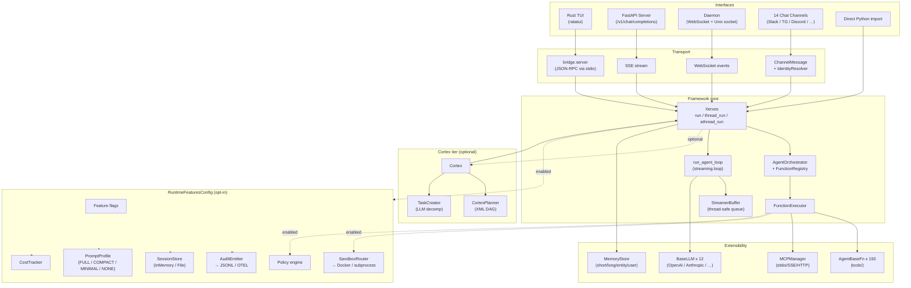
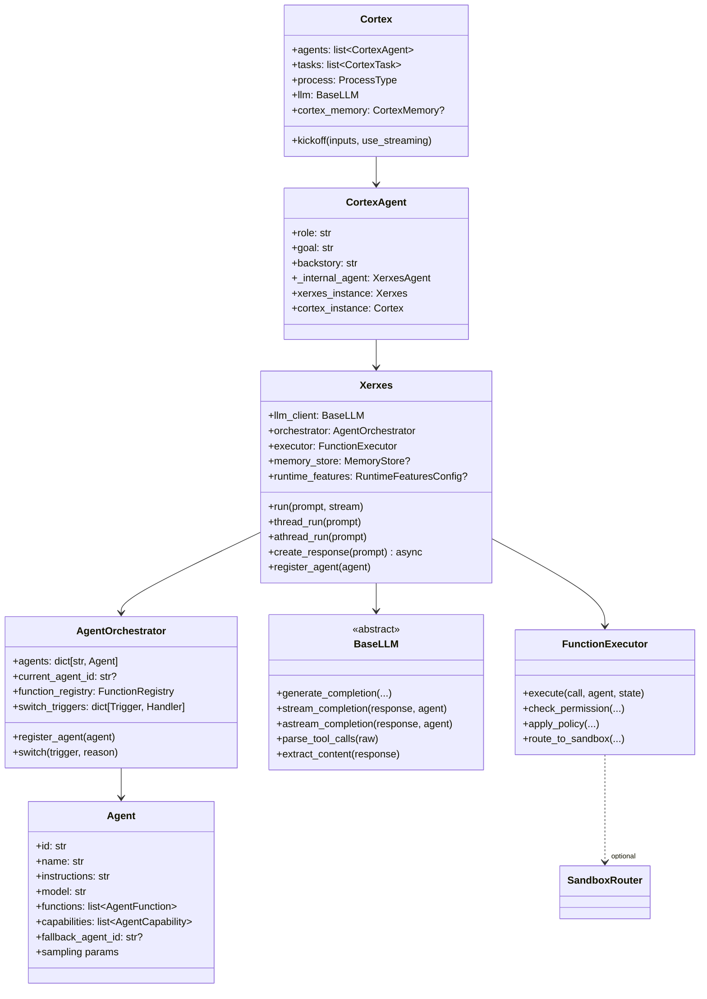
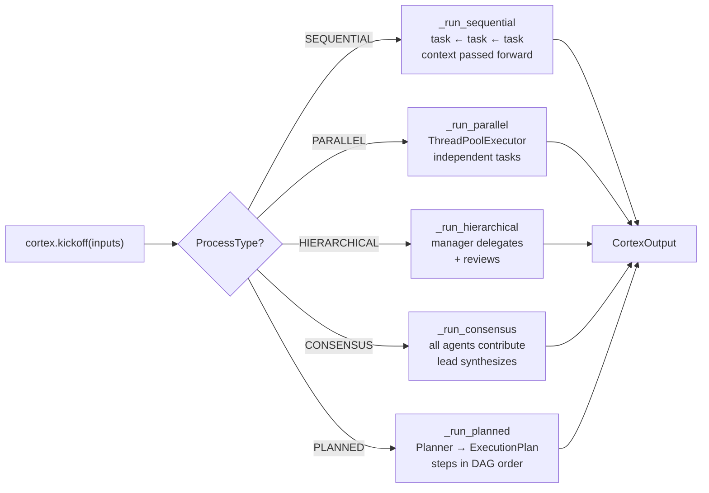
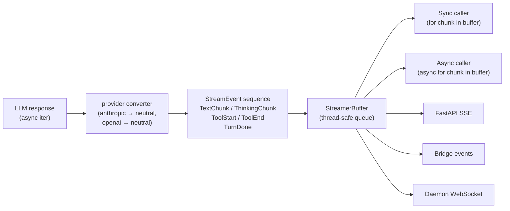
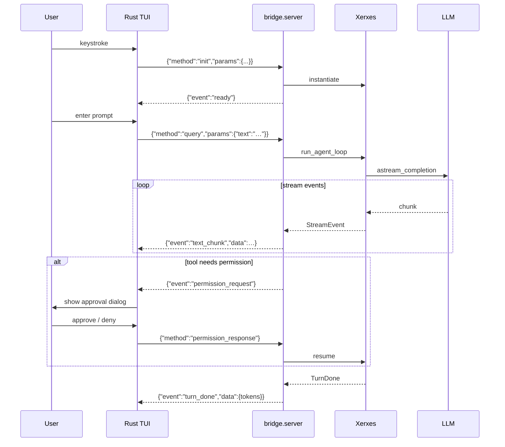
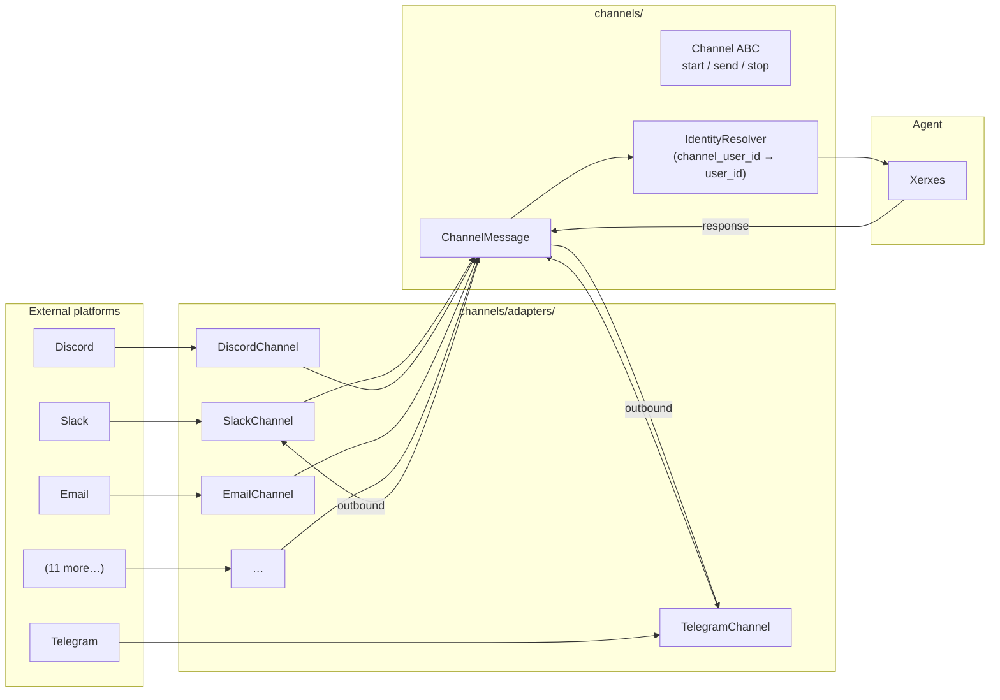
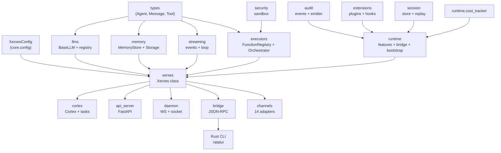
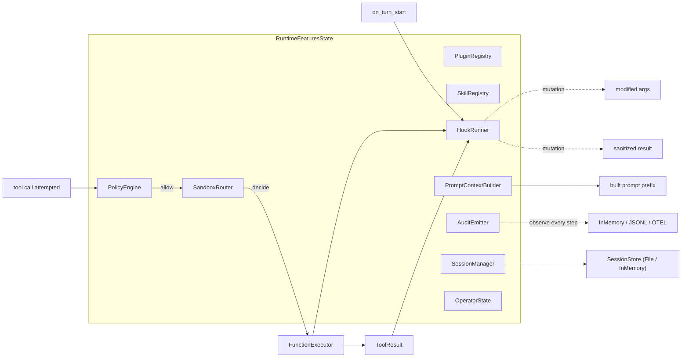
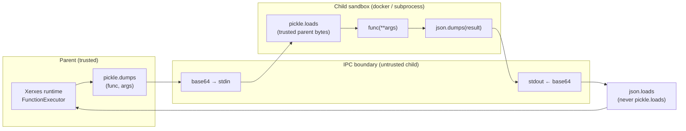
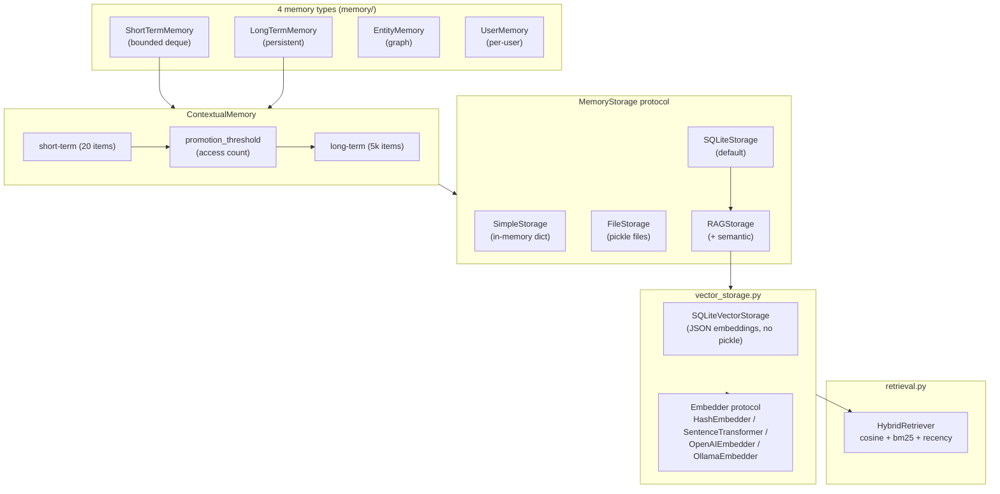

# System Architecture

## 30-second mental model



The picture: each interface (TUI, HTTP, daemon, channel, embed) hands a user prompt to the Xerxes core; the core runs a streaming loop through `BaseLLM`, executes tools via `FunctionRegistry`, consults `MemoryStore`, and — if `RuntimeFeaturesConfig.enabled` is true — routes every tool call through the sandbox + policy engine and fires an audit event before and after.

## Component relationships



## Basic execution loop

When a caller invokes `xerxes.run("write a haiku about tensors")`:

```mermaid
sequenceDiagram
    participant Caller
    participant Xerxes
    participant Orchestrator as AgentOrchestrator
    participant Loop as run_agent_loop
    participant LLM as BaseLLM
    participant Executor as FunctionExecutor
    participant Sandbox
    participant Memory
    participant Audit as AuditEmitter

    Caller->>Xerxes: run(prompt)
    Xerxes->>Orchestrator: pick current agent
    Xerxes->>Memory: recall relevant context (opt)
    Xerxes->>Loop: run(messages, agent, llm)

    loop Until no more tool calls
        Loop->>LLM: astream_completion(messages)
        LLM-->>Loop: TextChunk / ToolStart / …
        alt contains tool call
            Loop->>Executor: execute(call, agent)
            Executor->>Audit: emit_tool_call_attempt
            alt RuntimeFeaturesConfig.enabled
                Executor->>Sandbox: decide(tool, agent)
                Sandbox-->>Executor: HOST or SANDBOX
            end
            Executor-->>Loop: ToolEnd(result)
            Executor->>Audit: emit_tool_call_complete
            Loop->>Memory: persist turn (opt)
        else no tool call
            Loop-->>Xerxes: TurnDone
        end
    end

    Xerxes-->>Caller: stream of events
```

Key points:
- The loop is **streaming by default.** Non-streaming = collect events + assemble.
- `FunctionExecutor` is the chokepoint — every tool call passes through it, so audit, policy, sandbox, loop-detection, and retries all live there.
- Memory writes are best-effort and never break the loop (exceptions are swallowed with a log).

## Cortex execution

`Cortex.kickoff()` dispatches on `ProcessType`:



For every process type, individual task execution goes through an internal `Xerxes` instance — i.e. Cortex is a layer on top of the basic loop, not a replacement.

## Streaming data flow



The same event stream drives four different transports — the only difference is the encoding on the wire.

## Rust TUI ↔ Python bridge



Protocol: newline-delimited JSON over the Python subprocess's stdin/stdout. Trivially observable (`pip install xerxes-agent && python -m xerxes.bridge | tee bridge.jsonl`).

## Channel adapter architecture



Every platform-specific payload is normalized to `ChannelMessage` (text, channel, channel_user_id, room_id, attachments, metadata). `IdentityResolver` maps `(channel, channel_user_id)` to a stable `user_id` — so the same human talking to the agent via Slack in the morning and Telegram in the evening has one persistent identity.

## Service dependency graph



Arrows show compile-time Python import dependency (A → B means B imports A). Leaves at the top: `types` and `core.config` are the base layer with no internal imports.

## Runtime feature layering

When `RuntimeFeaturesConfig.enabled = True`, `RuntimeFeaturesState` is instantiated once and wired into every tool call and turn boundary:



All sinks are optional; a missing backend degrades gracefully (structlog / OpenTelemetry / Prometheus are all soft-imported).

## Sandbox isolation boundary



**Key invariant:** parent→child uses pickle (parent is trusted), child→parent uses JSON (child could be adversarial). The earlier pickle-symmetric design was an arbitrary-code-execution vector via `__reduce__`; it's now closed. See [security fix commit](../debug/260418-1007-fullhunt/findings.md) for the underlying PoC.

## Memory architecture



## Runtime profiles

`PromptProfile` controls how much context is injected into the system prompt of each agent:

| Profile | Use case | Includes |
|---------|----------|----------|
| `FULL` (default) | Top-level user-facing agent | Everything: runtime info, workspace, sandbox status, skills, tools, guardrails, bootstrap, memories, user profile |
| `COMPACT` | Sub-agent delegation | Trimmed bootstrap, skill instructions capped at 500 chars, tool list capped at 20 |
| `MINIMAL` | Internal tool agent | Only sandbox, guardrails, 10-entry tool list |
| `NONE` | OpenClaw-style control | Identity only; caller supplies all context explicitly |

## Cross-references

- Per-package file listing: [codebase-summary.md](codebase-summary.md).
- How to run the HTTP server and full endpoint spec: [api-reference.md](api-reference.md).
- Env vars, `XerxesConfig`, runtime flags: [configuration-guide.md](configuration-guide.md).
- How to run and extend tests: [testing-guide.md](testing-guide.md).
